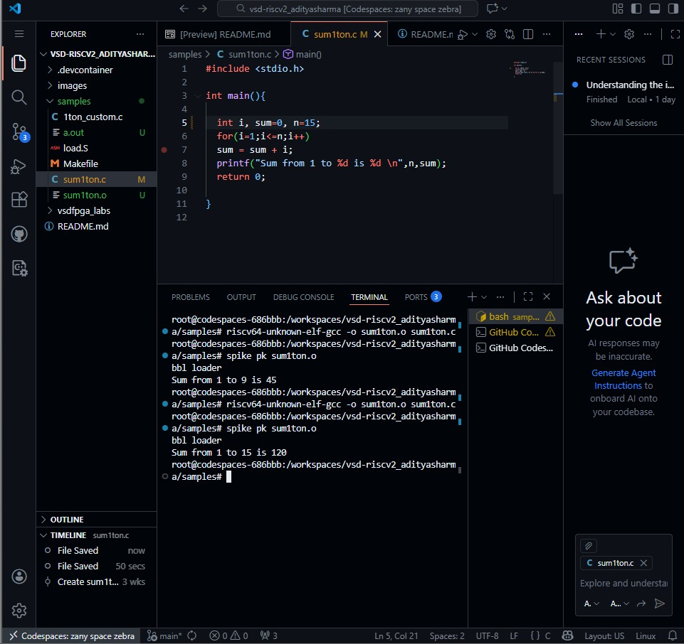
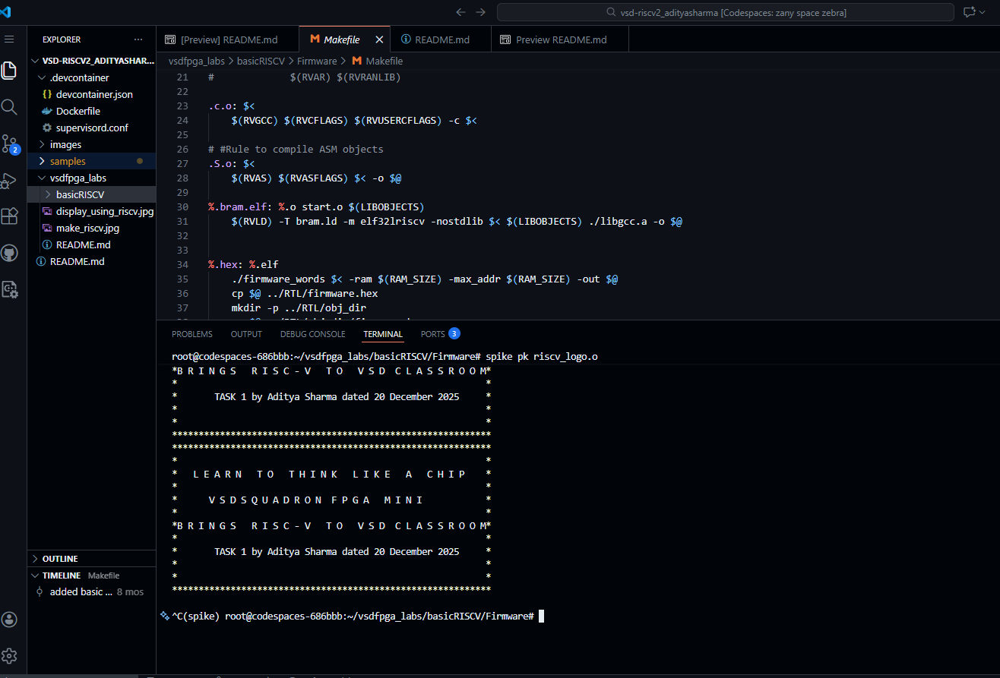
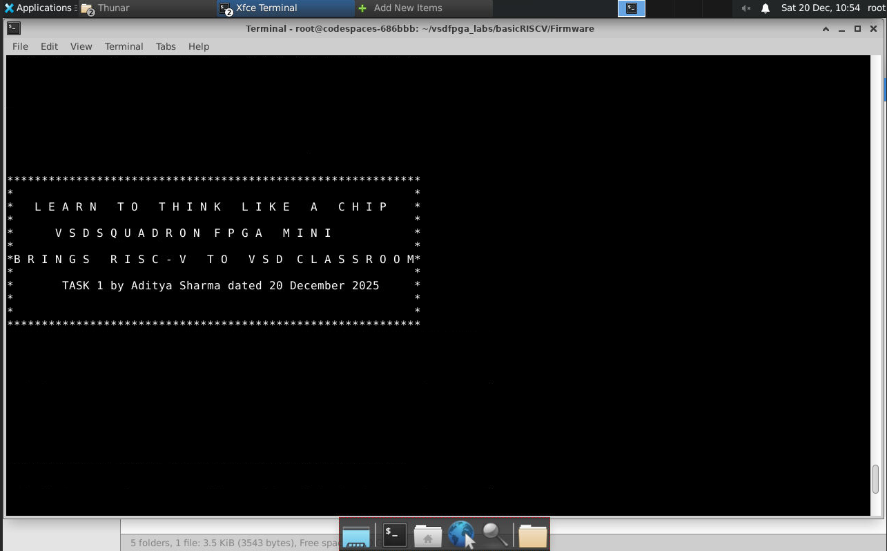
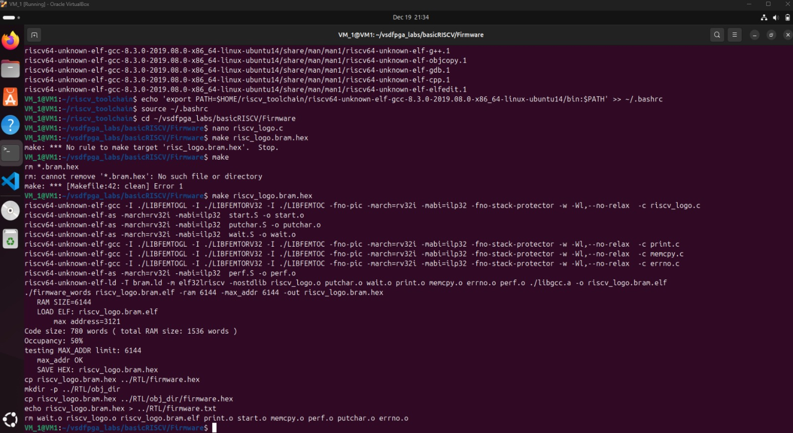

# Task-1: Environment Setup & RISC-V Reference Bring-Up

 This repository contains the informartion about how the task performed for vsdsquadron lab which involves the environment setup and the verification of the same

## Setup of the GitHub Codespace

1. Forking the vsd-riscv2 repository to my GitHub account as vsd-riscv2_adityasharma.
2. Created the Codespace in my repository by going to Code-> Create Codespace on main.
3. After the succesfull build of the Codespace, verified the environment setup.
4. Then run the simple c program and the edited version of it with the help of spike simulator.

## C code Ouput without or with changes:

  
   
  <b>Figure 1: Output of the c code running through spike simulator with n = 9 and n = 15 respectively as seen in the terminal.</b>

## Final Ouput:

  
   
  <b>Figure 2: This contained the final output of file riscv_logo.o with the modification of "TASK 1 by Aditya Sharma dated 20 December 2025"</b>

## Setup of the noVNC GUI Desktop

1. From the ports tab,  follow thw steps mentioned in the readme provided to us.
2. Then running the same program in this noVNC Desktop as ran in the COdespace from the (native gcc compiler) and the (riscv gcc compiler and spike).

## C code Ouput without or with changes:

  
   
  <b>Figure 1: Output of the c code running through spike simulator with n = 9 and n = 15 respectively as seen in the terminal.</b>

## Final Ouput:

  
   
  <b>Figure 2: This contained the final output of file riscv_logo.o with the modification of "TASK 1 by Aditya Sharma dated 20 December 2025"</b>

## Verification of the RISC-V Reference Flow

1. Install the pre-requisites mentioned in the readme file for vsdfpga_labs.
2. Make the riscv_toolchain directory where riscv64 gcc compiler will get downloaded, unzip it and install it.
3. Then set the bin path of the gcc compiler in the environment variables.

## Setup of the Local Machine (tricky part)

1. Download Ubuntu from the official website.
2. Download the Oracle Virtual box and make a VM in it. (Note:- I named my VM as VM_1)
3. Now install the Docker and make a Docker image using the Dockerfile provided with some changes in it, according to the need (Note:- I just removed the part that i need for the noVNC setup and rest of the libraries installation was done as i will going to need them some day for this internship.
4. After everything is installed, now run the code which will produce the output result step by step as mentioned in the readme file of vsdfpga_labs after installing the pre-requisites needed for the completion of the task1.
5. Change something in the riscv_logo.c file while opening it through nano gnu, (for example the date and the name).

## Final Ouput:

  
   
  <b>Figure 2: This contained the step just above the final output of file riscv_logo.o for the local setted up VM"</b>

*Note:- I am getting issue while downloading spike in the local setup with the docker and without the docker that's why not getting the final output, hence working on it.
Once I'll figure that out in the offline setup will attach here.

Yay, now we have setup a clean working environment for the FPGA development purposes for the Git CodeSpace and noVNC.
